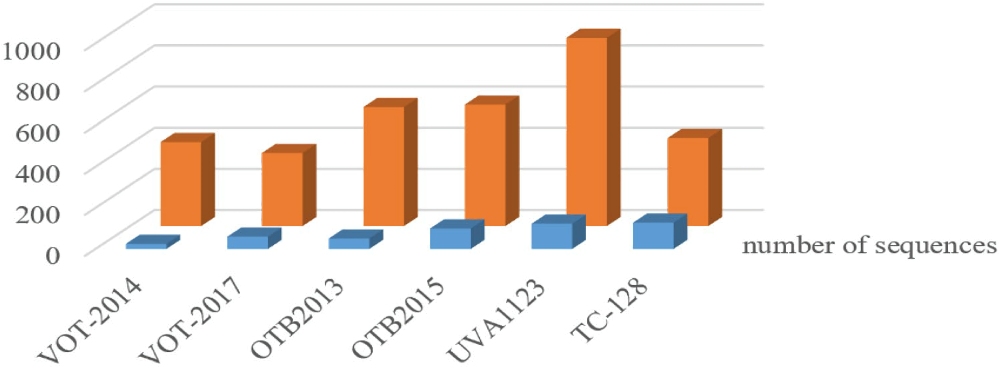

# 目标跟踪算法调研

## 一、目标跟踪 (Object Tracking) 算法

### 1.1 单目标跟任务

#### 1.1.1 步骤

* 输入图像并**提取特征**

  * 特征对跟踪器性能影响巨大，**常用的特征有手动特征和卷积特征**
    * 手动特征：包括基于图像自身的底层特征（颜色、纹理和形状等）和基于底层特征上多特征融合处理得到的中层特征
      * 底层特征特点：相对简单，无需学习与训练，仅需简单计算与统计
      * 中层特征特点：比较复杂——主要体现在提取策略与融合过程
    * 卷积特征：包括底层特征、中层特征和通过神经网络模型得到的更加抽象的深度特征
      * 深度特征特点：无需手工参与，受光照、姿态等影响较小，**具有更好的鲁棒性**，但特征表达方式无法明确知道
  * 深度学习具有强大的特征提取能力，这使其成为研究热点

* **生成候选区域**

  * 常见的方法是粒子滤波器预测和滑动窗口
    * 前者使用**推理**来预测候选区域，而后者则使用**穷举**方法

* **建立跟踪模型**

  * **建立目标跟踪模型并准确选择候选区域是目标跟踪任务的核心**

  * 现有的目标跟踪模型包括**生成模型**和**判别模型**

    * 最大后验概率 (Maximum A Posteriori, MAP) 估计

      * 作用
        * 可以利用经验数据获得对未观测量的点态估计

      * 公式

        * $$
          \mathop{\rm argmax}\limits_{\theta}P\left(\theta|x_0,x_1,x_2,\dots,x_n\right)=\mathop{\rm argmax}\limits_{\theta}P\left(x_0,x_1,x_2,\dots,x_n\right|\theta)\times P\left(\theta\right)
          $$

      * 特点
        * 扩充了优化的目标函数，其中融合了预估计量的先验分布信息
        * MAP可以看作是正则化的最大似然估计 (Maximum Likelihood Estimate, MLE)

    * 生成模型
      * 学习时先得到 P (x, y)，继而得到 P (y∣x)
      * 预测时应用 MAP 得到预测类别 y
      * 关注数据是**如何产生**的
    * 判别模型
      * 直接学习得到 P (y∣x) ，利用MAP得到 y
      * 或直接学得一个映射函数 y = f (x)
      * 只关注**样本之间的差别**，而不关注数据如何生成

* 适时**更新模型**

  * 模型需要随环境和对象本身的变化而进行更新

* 输出结果

#### 1.1.2 算法分类

* 经典算法
  * 算法
    * 光流算法
    * 滤波器法
    * 基于核的方法
  * 局限性
    * 复杂的计算和低精度限制了该类方法进一步的发展
* 当前算法
  * 算法
    * 基于相关滤波器 (Correlation Filters, CF) 的目标跟踪算法——关滤波器的应用提高了跟踪器的速度和精度
    * 基于深度学习的目标跟踪算法——因强大的图像处理能力受到关注
  * 

### 1.2 数据集

#### 1.2.1 常用数据集

* 

#### 1.2.2 VOT 数据集

#### 1.2.3 OTB 数据集

#### 1.2.4 TColor-128 数据集

#### 1.2.5 UAV-123 数据集

#### 1.2.6 LASOT 数据集

### 1.3 CF

#### 1.3.1 信号相关性

* 指一个信号与它自身或其他信号在各个时刻的相似程度

#### 1.3.2 原理

* 计算两个信号之间的相关性

  * 即卷积计算公式

  * $$
    \left(u\otimes v\right)=\int_{-\infty}^{+\infty}u^*\left(t\right)v\left(t+\tau\right)dt
    $$

    * \* 表示复共轭

  * 离散表示

    * $$
      \left(u\otimes v\right)\left(n\right)=\sum_{-\infty}^{\infty}u^*[m]v\left(m+n\right)dt
      $$

## 二、经典算法

### 2.1 光流法

#### 2.1.1 基本思想

* 通过寻找两帧之间对应的像素位置来计算物体的运动趋势，从而获得跟踪信息

### 2.2 滤波器法

#### 2.2.1 基本思想

* 通过卡尔曼滤波或粒子滤波等滤波算法利用先前的状态来预测当前的状态，然后根据观测信息修改预测结果
  * 卡尔曼滤波
    * 利用线性系统状态方程，通过系统输入输出观测数据，对系统状态进行最优估计的算法——由于观测数据中包括系统中的噪声和干扰的影响，所以最优估计也可看作是滤波过程
    * 线性数学模型算出**预测值** + 传感测**量值** = **更准确的测量值**
  * 粒子滤波
    * 通过利用一组**带权值的系统状态采样**来**近似状态的统计分布**——基于蒙特卡罗仿真思想

### 2.3 基于核的方法

#### 2.3.1 基本思想

* 提取初始对象和当前候选区域的颜色直方图，并迭代调整 MeanShift 向量以指向与原始对象相似度最高的候选区域
  * MeanShift 算法
    * 求解点 x 与周围所有点 x~i~ 的平均偏移量，然后让 x 向平均偏移量方向移动，再以此为新的起点不断迭代直到满足一定条件结束

## 三、基于 CF 的目标跟踪算法

### 3.1 MOSSE (Minimum Output Sum Square Error) 算法

#### 3.1.1 基本信息

* 作者
  * David S. Bolme
  * J. Ross Beveridge
  * Bruce A. Draper
  * Yui Man Lui
  * 均为 Colorado State University 团队成员
* 提出时间
  * 2010
* 论文
  * Bolme D S, Beveridge J R, Draper B A, et al. Visual object tracking using adaptive correlation filters[C]//2010 IEEE computer society conference on computer vision and pattern recognition. IEEE, 2010: 2544-2550.

#### 3.1.2 基本思想

* 根据第一帧图像框选的目标构建一个响应，该响应在所绘制的目标框的中心处的响应值最大，向四周缓慢衰减（即二维高斯分布）
* 找到一个滤波器使得图像和这个滤波器进行相关运算之后刚好得到的就是这个响应，便可以根据响应值最大处求得目标的位置了
* 当新的一帧图像进来时，用之前得到的滤波器与新的图像进行相关运算，就可以得到新的目标位置了

* 使用快速傅里叶变换 (Fast Fourier Transform, FFT) 来计算傅里叶域中的相关性，以创建快速跟踪
  * FFT
    * 特点：可在 O(nlogn) 时间内完成的离散傅里叶变换 (Discrete Fourier transform，DFT) 算法
    * 作用：可以用来加速多项式乘法
* 当目标被遮挡时，判断目标跟踪的状态，并根据 PSR (Peak to Sidelobe Ratio) 值更新滤波器参数。 当物体再次出现时，可以再次对其进行跟踪。
  * main lobe（主瓣）：最大辐射方向周围的区域——通常是主波束峰值 3dB 以内的区域
  * side lobe（旁瓣）：主波束周围辐射较小的波束——MOSSE 中定义为峰值周围 11 \* 11 窗口之外的其余像素
  * back lobe（后瓣）：与主瓣相反方向的旁瓣

#### 3.1.3 方法

* 计算输入图像 (F = F(f )) 和滤波器 (H = F(h)) 的 2D-FFT

* 卷积定理指出，**相关性是傅里叶域中的元素乘法**。相关表示如下

  * $$
    g=f\otimes h
    $$

    * g 和 f 分别表示响应输出、输入图像，h 表示滤波器模板，也被称为相关核

  * 图像的相关公式表示为

    * $$
      g\left(i,j\right)=\sum\limits_{k,l}f\left(i+k,j+l\right)h\left(k,l\right)
      $$

    * i, j 分别为当前像素点的横纵坐标，k, l 分别为相关核对应的偏移点的横纵坐标

* 利用 FFT 快速计算，上式可变为

  * 通过将卷积运算变为点乘运算，从而减少运算量

  * $$
    F\left(g\right)=F\left(f\otimes h\right)=F\left(f\right)\cdot F\left(h\right)^*
    $$

    * \* 表示共轭

  * 缩写为

    * $$
      G=F\cdot H^*
      $$

  * 求解目标为

    * $$
      H^*=\frac{G}{F}
      $$

* 在实际跟踪过程中，需要考虑物体的外观等因素的影响, 同时以存在对象的 m 张图像作为参考可以显著提高滤波器模板的鲁棒性，故 **MOSSE 模型公式**如下
  $$
  \mathop{\rm argmin}_{H^*}=\sum\limits_{i=1}^{m}\left|H^*F_i-G_i\right|^2
  $$

* 经由一些列变换，得到**封闭解**

  * $$
    H^*=\frac{\sum_iG_i\bullet F_i^*}{\sum_iF_i\bullet F_i^*}
    $$

* 跟踪器更新方法公式为

  * $$
    H_i^*=\frac{A_i}{B_i};\\
    A_i=\upeta G_i\odot F_i^*+\left(1-\upeta\right)A_{i-1};\\
    B_i=\upeta F_i\odot F_i^*+B_{i-1}.
    $$

* 用 PSR 值检测是否跟踪失败

  * $$
    PSR=\frac{g_{max}-\mu_{sl}}{\sigma_{sl}}
    $$

    * g~max~ 为峰值，μ~sl~, σ~sl~ 为旁瓣的均值和标准差

  * PSR 值在 20~60 之间被认为是良好的跟踪效果

  * 当 PSR 值低于 7 时，判断跟踪失败，不更新模板

#### 3.1.4 特点

* ==**首次将 CF 技术引入视觉跟踪领域**==
* 实现 669 fps 的惊人跟踪速度， MOSSE 滤波器的运行速度比先进的多实例在线学习 (Multi-Instance Learning, MIL) 算法快 26 倍
  * MIL: 在目标周围选取正负样本，通过一种多实例在线学习的方法，训练弱分类器，并且选择合适的特征进行组合，形成强分类器
* 由第一帧进行训练，对于光照、尺度和姿态变化可以具有很强的鲁棒性能
* **可以应对小规模的遮挡等问题**，但无法应对大规模变化
* 样本采样仍然是稀疏采样，训练效果一般

### 3.2 CSK (Exploiting the Circulant Structure of
Tracking-by-detection with Kernels) 算法

#### 3.2.1 基本信息

* 作者
  * João F. Henriques
  * Rui Caseiro
  * Pedro Martins
  * Jorge Batista 
  * 均为葡萄牙 Institute of Systems and Robotics, University of Coimbra 团队成员
* 提出时间
  * 2012
* 论文
  * Henriques J F, Caseiro R, Martins P, et al. Exploiting the circulant structure of tracking-by-detection with kernels[C]//Computer Vision–ECCV 2012: 12th European Conference on Computer Vision, Florence, Italy, October 7-13, 2012, Proceedings, Part IV 12. Springer Berlin Heidelberg, 2012: 702-715.

#### 3.2.2 基于MOSSE的改进

* 采用**密集采样**方法以解决缺少样本的问题——密集采样会导致计算负担问题——将**循环矩阵**的性质引入 FFT 来加速算法
* 引入**核技巧**来提高精度——使用高斯核来计算两个相邻帧之间的相关性

#### 3.2.3 方法

* CSK 线性分类器求解 CF 跟踪器表达式为

  * $$
    \min\limits_{w}\sum\limits_{i}^{n}\left(f\left(x_i\right)-y_i\right)^2+\lambda||w||^2
    $$

    * w 对应 MOSSE 中的 CF H
    * i 为密集采样后的样本数
    * λ 是正则化参数，防止过拟合

  * 相较于 MOSSE 公式，仅**额外添加了一个正则项来防止过拟合**

  * 该目标式本质是一个岭回归 (Ridge Regression) 模型

    * 意义：解决由于 X^T^X 通常不满秩的情况（例如变量数远大于样本数）而导致无法使用标准线性回归模型的问题
    * 目的：将不适定问题 (ill-posed problem) 转化为适定问题 (well-posed problem) 
      * 适定问题：解必须存在且唯一，同时解必须稳定（根据初始条件连续变化）——很多计算机视觉问题无法满足后两点条件

* ==**循环矩阵 (Circulant Matrices)**==

  * 形式

    * $$
      X=C\left(x\right)=
      \begin{bmatrix}
      x_1 & x_2 & x_3 & \dots & x_n\\
      x_n & x_1 & x_2 & \dots & x_{n-1}\\
      x_{n-1} & x_n & x_1 & \dots & x_n\\
      \vdots & \vdots & \vdots & \ddots & \vdots & \\
      x_2 & x_3 & x_4 & \dots & x_1\\
      \end{bmatrix}
      $$

    * 

  * 构建训练样本

    * 按照循环矩阵首行形式构建样本，然后按照循环矩阵形式生成样本——将负样本的计算转换到频域下求解

  * 特性
  
    * 无论生成向量 x 为何，X 均可通过 DFT 对角化
  
    * $$
      X=F\mathop{\rm diag}\left(\hat{x}\right)F^H=F\mathop{\rm diag}\left(\hat{x}\right)F^{-T}\\
      \hat{x}=F\left(x\right)=\sqrt{n}Fx
      $$
  
    * F 是不依赖于 x 的常数矩阵，F^H^ 是 F 的厄米特转置

### 3.3 KCF (Kernel Correlation Filter) 算法

#### 3.3.1 基本信息

* 作者
  * Joao F. Henriques
  * Rui Caseiro
  * Pedro Martins
  * Jorge Batista
  * 均为葡萄牙 Institute of Systems and Robotics, University of Coimbra 团队成员
* 提出时间
  * 2014
* 论文
  * Henriques J F, Caseiro R, Martins P, et al. High-speed tracking with kernelized correlation filters[J]. IEEE transactions on pattern analysis and machine intelligence, 2014, 37(3): 583-596.

#### 3.3.2 基于 CSK 的改进

* 采取==**多通道方向梯度直方图 (Histogram of Oriented Gradient, HOG 特征**==以提升准确率
  * HOG
    * 含义：一种在计算机视觉和图像处理中用来进行物体检测的特征描述子
    * 方法：通过计算和统计图像局部区域的梯度方向直方图来构成特征
  * 对于多通道的特征描述符，只需在傅立叶域中对每个通道的各个点积求和即可
    * 傅里叶域：时域信号经由傅里叶变换后所在的频域

#### 3.3.3 缺点

* 存在**固定尺度问题**

* 循环移位导致的**边缘效应问题**
  * 边缘效应
    * 传统的 CF 方法通过**滤波器求解得到的响应最高位置就是跟踪目标所在位置**，公式求解通过傅里叶变换转到频率域可极大简化运算速度，甚至实现算法的实时性
    * 傅里叶变换将处理的图像窗口边缘进行循环拼接，导致**边缘处不连续**
* 搜索区域固定导致在**目标快速运动时很容易超出搜索范围**

### 3.4 DSST 和 fDSST 算法

#### 3.4.1 基本信息

* 作者
  * Martin Danelljan
  * Gustav Hager
  * Fahad Shahbaz Khan
  * Michael Felsberg
  * 均为 Department of Electrical Engineering, Linkoping University 团队成员
* 提出时间
  * DSST: 2016
  * fDSST: 2014
* 论文
  * DSST
    * Danelljan M, Häger G, Khan F, et al. Accurate scale estimation for robust visual tracking[C]//British machine vision conference, Nottingham, September 1-5, 2014. Bmva Press, 2014.
  * fDSST
    * Danelljan M, Häger G, Khan F S, et al. Discriminative scale space tracking[J]. IEEE transactions on pattern analysis and machine intelligence, 2016, 39(8): 1561-1575.

#### 3.4.2 主要创新点

* DSST
  * 引入==**尺度估计**==——**解决 KCF 等目标跟踪算法固定尺度的问题**
    * 在新的帧中，首先使用**二维位置 CF** 确定目标的新的**候选位置**
    * 使用**一维尺度 CF** 来获取以当前中心位置为中心点的不同尺度的候选块，从而找到**最匹配的尺度**
      * 通过尺度金字塔表示来学习得到尺度滤波器

* fDSSST

  * 使用**特征降维**和**插值**技术加快计算**速度**——DSST 使用 33 个尺度估计导致计算量剧增
    * 主成分分析法 (Principal Component Analysis, PCA) 降低了位置滤波器的特征维数
      * PCA: 通过某种线性投影的方式将高维数据映射到低维空间中表示，并期望在投影的维度上数据的方差最大，以此使用较少的数据维度的同时，保留原有数据点特征
    * 采用三角插值的方式补充到 33，以弥补样本不足的问题

  * 通过正交三角 (QR) 分解可以在缩放滤波器中几乎无损地减少 1000 \* 17 至 17 \* 17 的损失
    * QR 分解
      * n 阶非奇异矩阵 A~n~ 可以分解成正交矩阵 Q~n~ 和非奇异上三角矩阵 R~n~ 的乘积
      * m \* n 阶非奇异矩阵 A~m*n~ 可以分解成正交矩阵 Q~m*n~ 和非奇异上三角矩阵 R~n*n~ 的乘积
  * **增大搜索框**以提高跟踪**精度**

#### 3.4.3 特点

* **提出的精确的尺度估计方法也适用于其它没有尺度估计的目标跟踪算法**

### 3.5 SRDCF 算法

#### 3.5.1 基本信息

* 作者
  * Martin Danelljan
  * Gustav Hager
  * Fahad Shahbaz Khan
  * Michael Felsberg
  * 均为瑞典 Computer Vision Laboratory, Linkoping University 团队成员
* 提出时间
  * 2015
* 论文
  * Danelljan M, Hager G, Shahbaz Khan F, et al. Learning spatially regularized correlation filters for visual tracking[C]//Proceedings of the IEEE international conference on computer vision. 2015: 4310-4318.

#### 3.5.2 主要创新点

* 在目标函数中==**添加正则惩罚项**==——**克服 CF 中的边缘效应**

  * 通过一个空间权值系数 w 来惩罚距离目标中心比较远的样本

  * 原始 DCF (Discriminative Correlation Filter) 算法的目标函数

    * $$
      \varepsilon_t\left(f\right)=\sum\limits_{k=1}^{t}\alpha_k||S_f\left(x_k\right)-y_k||^2+\lambda\sum\limits_{l=1}^{d}||f^l||^2
      $$

  * SRDCF 算法的目标函数

    * $$
      \varepsilon_t\left(f\right)=\sum\limits_{k=1}^{t}\alpha_k||S_f\left(x_k\right)-y_k||^2+\lambda\sum\limits_{l=1}^{d}||w\bullet f^l||^2
      $$

    * f 是滤波器模板，l 是第 l 个通道，w 是正则系数矩阵

* 将尺度划分为若干尺度以克服尺度变化

* 使用 **Gauss-Seidel 函数**来求解滤波器——避免对参数进行逆求

### 3.6 STAPLE 算法

#### 3.6.1 基本信息

* 作者
  * Luca Bertinetto
  * Jack Valmadre
  * Stuart Golodetz
  * Ondrej Miksik
  * Philip H.S. Torr
  * 均为牛津大学团队成员
* 提出时间
  * 2016
* 论文
  * Bertinetto L, Valmadre J, Golodetz S, et al. Staple: Complementary learners for real-time tracking[C]//Proceedings of the IEEE conference on computer vision and pattern recognition. 2016: 1401-1409.

#### 3.6.2 主要创新点

* 利用 ==**HOG 和颜色特征进行融合**==——达到了 80fps 的速度
  * 以往的算法模型学习依赖于跟踪对象的空间信息，对形变不具有鲁棒性
  * 利用颜色特征来学习物体在形变和运动模糊的情况下可以很好地跟踪，但在光线变化时颜色特征不能很好地表达目标特征——**颜色特征对物体形变和运动模糊具有鲁棒性**
  *  HOG 特征可以在光照变化下跟踪物体——**HOG 特征对光照变化具有鲁棒性**

### 3.7 LMCF 算法

#### 3.7.1 基本信息

* 作者
  * Mengmeng Wang (Institute of Cyber-Systems and Control, Zhejiang University)
  * Yong Liu (Institute of Cyber-Systems and Control, Zhejiang University)
  * Zeyi Huang (Exacloud Limited, Zhejiang)
* 提出时间
  * 2017
* 论文
  * Wang M, Liu Y, Huang Z. Large margin object tracking with circulant feature maps[C]//Proceedings of the IEEE conference on computer vision and pattern recognition. 2017: 4021-4029.

#### 3.7.2 主要创新点

* 采用==**多峰前向检测**==来**避免相似物体干扰**

  * 背景

    * 由于结构化 SVM 比传统 SVM 具有更强的判别力，因此将结构化 SVM 与 CF 算法结合起来
    * 在跟踪过程中，当目标周围存在类似的干扰物体时，响应图通常会出现多个峰值——最高峰可能是干扰物，可能会造成误判

  * 主要思想

    * 如果**其他峰峰值与主峰峰值的比例大于阈值 APCE**，说明响应图是多峰模式，以这些多峰为中心重新检测，并取这些响应图的最大值作为最终目标位置

      * APCE

        * 意义

          * 反映了响应图的振荡程度——可以判断目标运动状态，从而确定模板的更新

        * 公式

          * $$
            APCE=\frac{|F_{max}-F_{min}|^2}{\mathop{\rm mean}\left(\sum_{w,h}\left(F_{w,h}-F_{min}\right)^2\right)}
            $$

          * F~max~、F~min~、F~w,h~ 分别表示最高、最低和坐标为 (w, h) 位置处的响应

* ==**高置信度更新**==

  * 如果 **APCE 突然下降，目标很可能被遮挡或丢失**——在这种情况下，模型不会更新以避免模型漂移
  * 当 APCE 和 F~max~ 大于历史平均值一定比例时，模型就会更新
  * 不仅减少了模型漂移和模型更新次数，还加快了算法的运行速度

### 3.8 BACF (Background-Aware Correlation Filters) 算法

#### 3.8.1 基本信息

* 作者
  * Hamed Kiani Galoogahi (Robotics Institute, Carnegie Mellon University)
  * Ashton Fagg (SAIVT Lab, Queensland University of Technology)
  * Simon Lucey (Robotics Institute, Carnegie Mellon University)
* 提出时间
  * 2017
* 论文
  * Kiani Galoogahi H, Fagg A, Lucey S. Learning background-aware correlation filters for visual tracking[C]//Proceedings of the IEEE international conference on computer vision. 2017: 1135-1143.

#### 3.8.2 主要创新点

* **增加样本数量**
  * 适当扩大目标搜索区域
    * 循环矩阵 + 适当增加的目标搜索区域 = 样本数量可以增加一个甚至多个数量级
* ==**提高样本质量**==
  * 
  * 通过循环移位获得一系列学习样本，通过裁剪算子 P 裁剪出每个移位图像的中心块，从而获得足够的正负样本
    * 正样本：包含目标和周围一小块的信息
    * 负样本：包含整幅图片上的背景信息——在传统的 CF 跟踪器中被直接舍弃

### 3.9 DRT 算法

#### 3.9.1 基本信息

* 作者
  * Chong Sun (School of Information and Communication Engineering, Dalian University of Technology)
  * Dong Wang (School of Information and Communication Engineering, Dalian University of Technology)
  * Huchuan Lu (School of Information and Communication Engineering, Dalian University of Technology)
  * Ming-Hsuan Yang (Electrical Engineering and Computer Science, University of California)
* 提出时间
  * 2018
* 论文
  * Sun C, Wang D, Lu H, et al. Correlation tracking via joint discrimination and reliability learning[C]//Proceedings of the IEEE conference on computer vision and pattern recognition. 2018: 489-497.

#### 3.9.2 主要创新点

* ==**引入置信度图进行可靠性学习**==

  * 目的
    * **避免**经过训练的 CF **被特征图上意外突出显示的区域所主导**，从而导致模型退化

  * 

  * 方法

    * 将原始跟踪模板 w 拆分为可靠性权重图 V~d~ 与原始滤波器 h~d~ 的点乘

      * $$
        W_d=h_d\odot V_d
        $$

    * 将权重图进一步划分为 9 个子区域的加权和，每个子权重图仅关注目标区域的一部分

      * $$
        V_d=\sum\limits_{m=1}^{M}\beta_mP_d^m
        $$

      * 权重有上限和下限，以保证跟踪器的稳定性

### 3.10 ASRCF (Adaptive Spatial Regularization Correlation Filter) 算法

#### 3.10.1 基本信息

* 作者
  * Kenan Dai
  * Dong Wang
  * Huchuan Lu (Peng Cheng Laboratory)
  * Chong Sun (Tencent Youtu Lab)
  * Jianhua L
  * 均为大连科技大学信息与通信工程学院团队成员
* 提出时间
  * 2019
* 论文
  * Dai K, Wang D, Lu H, et al. Visual tracking via adaptive spatially-regularized correlation filters[C]//Proceedings of the IEEE/CVF Conference on Computer Vision and Pattern Recognition. 2019: 4670-4679.

#### 3.10.2 主要创新点

* 提出了一种新的==**自适应空间正则化**==相关滤波器 (ASRCF) 模型
  * 背景
    * SRDCF 和 BACF 算法对滤波器系数施加的额外的空间约束，通常针对不同的对象是固定的，并且不能充分利用目标的多样性信息
    * 目标定位和尺度估计通常在同一特征空间上进行，这需要在跟踪过程中提取多尺度特征图—— 当跟踪器利用一些强大而复杂的特征时，该策略会显著增加计算量并减慢跟踪速度
  * 作用
    * 可以有效地估计目标的感知空间正则化
    * 在跟踪过程中获得更可靠的滤波器系数

* 通过两个 CF 模型估计目标位置和尺度
  * 在 一张的特征图上，使用浅层和深层特征来精确定位
  * 在 5 张不同尺度的特征图上，使用浅层特征进行快速尺度估计

### 3.11 总结

#### 3.11.1 CF 特点

* 高速
* 高精度

#### 3.11.2 局限性

* 边缘效应
* 尺度效应

#### 3.11.3 算法改进方向

* 模板更新策略
* 特征改进
* 区域检测

## 四、基于深度学习的目标跟踪算法

### 4.1 深度学习模型

#### 4.1.1 数据不变方法

* 概念来源
  * 在 DNN 发展的早期阶段，DNN 是**静态模型**，其**架构固定**，参数在训练阶段迭代更新
  * 一旦网络经过训练，其架构和参数将用于处理所有测试样本
* 类别
  * CNN
    * 基本组成结构
      * **卷积层**、池化层、批量归一化层、修正线性单元和全连接层
    * 局限性
      * 卷积层生成的输出的分辨率由卷积核的维度、步长、膨胀和空间分辨率等因素决定，所有这些因素都与每个卷积层的感受野密切相关
      * 每个卷积层的因素共同影响卷积神经网络的感受野
    * 基础优化方法：增加 CNN 的深度或宽度
  * RNN
    * 应用背景
      * 用于处理视频和自然语言等**序列数据**
    * 基本思想
      * 在处理序列数据的过程中，每个循环单元不仅获得先前单元的隐藏状态，而且还根据时间戳获取输入
      *  序列数据之间的短期和长期关系都是动态学习的并转移到后续单元
    * 局限性
      * RNN 需要维护每个时间戳的激活向量，使得大多数 RNN 非常深，从而导致**梯度爆炸和消失**的问题，以致于 RNN 难以训练
        * 梯度爆炸可以通过对这些梯度的范数采用硬约束来解决
    * 常见优化模型
      * 长短期记忆 (Long Short Term Memory, LSTM)
      * 门控循环单元 (Gated Recurrent Unit, GRU)
        * 相较于 LSTM，更容易忘记与最近输入无关的长期信息，因此在最复杂的任务上具有更好的性能
  * GNN (Graph Neural Networks):
    * 应用背景
      * CNN 和 RNN 被广泛用于处理欧几里德数据或序列数据
        * 欧几里德数据
          * 具有很好的**平移不变性**
          * 对于这类数据以其中一个像素为节点，其邻居节点的数量相同——可以很好的定义一个**全局共享的卷积核来提取图像中相同的结构**
          * 常见这类数据有图像、文本、语言
      * 但其无法处理以**图形形式表示的数据**
    * 基本实现思路
      * CNN → GNN
        * 图像可以被视为全连接图，其中所有像素都由相邻像素连接
        * 标准卷积层也可以看作是一种特殊的图卷积层，其中所有卷积核以无向方式连接[
      * RNN → GNN

* 局限性
  * 泛化能力不是很好

#### 4.1.2 数据自适应方法

* 注意力机制
* 动态神经网络
* 其它神经网络

### 4.2 深度跟踪器组件

#### 4.2.1 特征提取模块

* 通过 DNN 提取图像中的高级特征和低级特征
  * **低级特征**包含更多的**目标位置信息**
  * **高级特征**包含更多**语义信息**，并且比低级特征更鲁棒

#### 4.2.2 运动估计模块

* 意义
  * 连续帧或跟踪目标之间的运动模式对于增强跟踪算法的鲁棒性和有效性非常重要
* 传统深度跟踪器运动估计模块
  * 基本思想
    * 用一个分支学习与先前目标外观相关的特征
    * 运动估计模块被设计用于构建目标模板，因此深度跟踪器可以动态更新跟踪目标的外观
  * 局限性
    * 由于运动估计模块往往会**忘记第一帧**的外观，因此很容易受到严重遮挡或视野外运动的影响
* 新式运动估计模块
  * 基本思想
    * 将搜索帧和其他帧作为输入
  * 作用
    * 从初始帧开始的出现可以在**一定程度上帮助避免跟踪漂移问题**
  * 局限性
    * **来自初始帧的过多信息会影响整体跟踪性能**

#### 4.2.3 回归模块

* 基本思想

  * 通过特征提取模块和运动估计模块，**获得相应图**

    * $$
      f_\theta\left(z,x\right)=\phi_\theta\left(z\right)*\phi_\theta\left(x\right)+b
      $$

    * θ 和 b 表示偏差项，z 和 x 分别表示目标模板和搜索帧，Φ 表示以此为参数的特征提取模块

  * **将响应图中的最大值作为目标位置**

  * 为了处理尺度变化，首先**手动给出几个尺度参数**，然后基于搜索框或固定因子**逐渐更新**

* 局限性

  * **手动提供的尺度参数无法完全处理尺度变化**
  * 基于 DNN 的特征提取模块随着特征的深入，会**丢失越来越多的空间信息**，从而导致跟踪性能较差

#### 4.2.4 损失函数

* 交叉熵损失函数 (Cross Entropy Loss Function)

  * 应用背景

    * 对于单目标跟踪任务，只有两种样本，即目标样本和背景样本，分别由属于被跟踪目标的像素和属于背景的像素组成

  * 特点

    * 可以让跟踪器**学习目标和背景的判别特征**

  * 公式

    * $$
      \mathop{Loss}\left(p,q\right)=
      -\sum\limits_x
      \left(
      p\left(x\right)\log q\left(x\right)+
      \left(1-p\left(x\right)\right)\log\left(1-q\left(x\right)\right)
      \right)
      $$

    * p 是样本的 expected contribution，q 是样本的 generated contribution

  * 局限性

    * 由于交叉熵损失函数**仅集中于每个像素的类别**，因此它**不能直接监督跟踪算法生成准确的边界框**
      * 交叉熵损失函数通常与其他损失函数（例如焦点损失函数或 IoU 损失函数）一起使用

* 平滑 L1 损失函数 (Smooth L1 Loss Function)

  * 公式

    * L1

      * $$
        \mathop{\rm L1}\left(x\right)=|x|
        $$

    * L2

      * $$
        \mathop{\rm L2}\left(x\right)=x^2
        $$

    * Smooth L1

      * $$
        \mathop{\rm SmoothL1}\left(x\right)=
        \begin{dcases}
        \lambda x^2,& \rm{if} \ |x|<\beta\\
        |x|-\gamma,& \rm otherwise
        \end{dcases}
        $$

      * λ, β 和 γ 均为预定义参数

  * 特点

    * 在训练深度跟踪器时，**梯度值适合脱离局部最优解**

      * 相较于 L2 损失函数，平滑 L1 损失函数会生成相对较小的值

      * 当 |x| < β 时，相较于 L1 损失函数，平滑 L1 损失函数会生成相对较大的值

    * 可以直接监督边界框

  * 局限性

    * 使深度跟踪器优先于短期模板
    * 单个损失函数无法有效监督所有模块
      * 常常以加权求和的方式联合使用多个损失函数
